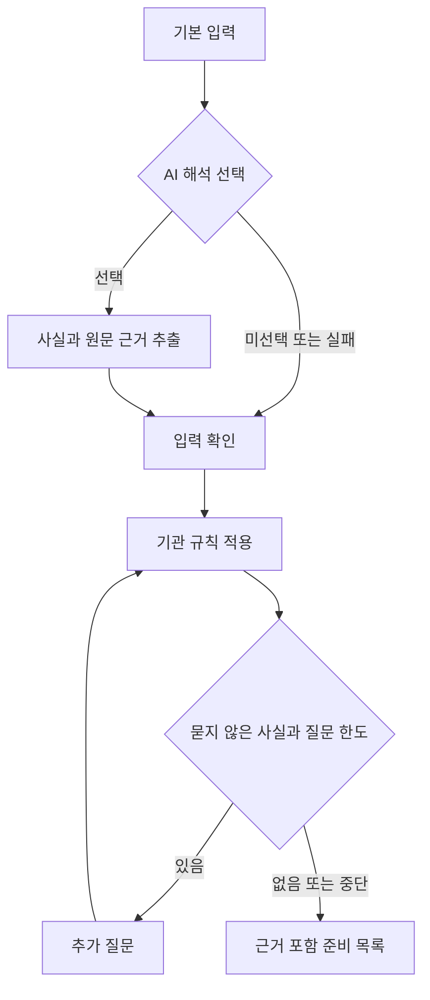

# 구조와 인터페이스

## 구성

Streamlit 화면이 Python 애플리케이션 함수를 직접 호출한다. 핵심 규칙 엔진은 표준 라이브러리만 사용한다. 별도의 API 서버, 데이터베이스, 벡터 데이터베이스, LangGraph는 이 버전의 필수 의존성이 아니다.



Agent의 다음 행동은 확인한 사실, 남은 규칙 조건, 이미 물은 질문, 질문 횟수에 의해 결정된다. LLM이 임의의 서류 목록을 생성하거나 웹 페이지 문구를 실행하지 않는다.

## 공개 함수

```python
from src.agent.api import start, confirm, rejudge, result
from src.agent.engine import next_questions

session = start("cuk", answers={
    "affiliated": "yes",
    "initial_review": "yes",
    "adult_only": "yes",
    "survey_interview_only": "yes",
    "consent_capable": "yes",
    "standard_consent": "yes",
    "graduate_student": "yes",
    "all_fulltime_faculty": "no",
})
session = confirm(session)  # AI 제안이 없을 때
questions = next_questions(session)
session = rejudge(session, {"collect_name": "yes", "collect_phone": "no"})
if session.phase == "questions":
    session = rejudge(session, stop=True)
assessment = result(session)
```

`rejudge`에는 현재 질문에 포함된 필드만 전달할 수 있다. 생략한 세부 답변은 `unknown`으로 기록한다. `confirm`은 화면에서 확인한 AI 제안의 필드만 받아들인다. 일반 답변 수정은 `revise(session, corrections)`를 사용한다.

| 함수 | 반환 / 효과 |
|---|---|
| `start(institution, answers, narrative, use_ai)` | 검토 단계의 독립된 Session 생성 |
| `confirm(session, accepted)` | 승인된 제안 반영 후 추가 질문 또는 결과 단계로 이동 |
| `next_questions(session)` | 현재 미확인 규칙에 필요한, 아직 묻지 않은 질문 선택 |
| `rejudge(session, answers, stop=False)` | 한 차례 답변을 반영하고 재판단 |
| `revise(session, corrections)` | 수정된 사실로 새 평가 시작. 준비 상태 초기화 |
| `result(session, today=None)` | 사실, 출처, 범위를 적용한 Assessment 반환 |

## 상태와 판단

`Session.answers`에는 객관식 답변과 사용자가 확인한 AI 사실만 들어간다. `proposals`는 승인 전 임시 제안이다. `origins`로 답변 출처를 구분한다. `seen_fields`는 모른다고 답한 항목도 포함하며 무한 질문을 막는다.

조건 언어는 `always`, `unresolved`, `equals`, `all`, `any`만 허용한다. `eval`이나 동적 Python 코드를 실행하지 않는다.

| 조건 결과 | 필요 여부 |
|---|---|
| 긍정 조건 만족 | 준비 필요 |
| 별도의 `exclusion_condition` 만족 | 현재 조건에서 비해당 |
| 나머지 | 확인 필요 |

단순히 긍정 조건이 거짓이라는 이유로 비해당을 반환하지 않는다. 범위가 확인되지 않거나 출처 재확인 주기를 넘기면 모든 관련 결과를 확인 필요로 낮춘다.

## AI 어댑터

`llm.py`는 공식 Python SDK의 `responses.parse`와 Pydantic 구조화 응답을 사용한다. 입력은 연구 설명이며 출력은 `field`, `value`, `evidence`의 목록이다.

검증 순서:

1. 응답 구조와 허용 필드, 값 검사
2. 같은 필드가 중복되면 전체 제안 거부
3. 근거 구절이 실제 입력의 연속 부분 문자열인지 확인
4. 기존 객관식 값과의 충돌 표시
5. 사용자가 확인한 제안만 반영

근거가 원문에 있다는 사실만으로 의미 해석까지 정확한 것은 아니다. 따라서 사용자 확인을 필수로 둔다. 모델의 신뢰도 점수로 서류를 제외하지 않는다.

요청 제한은 25초, 자동 재시도 0회, 출력 토큰 상한 1,800이다. 실패하면 원문 예외를 노출하지 않고 객관식으로 진행한다. `store=False`를 사용하지만 이를 외부 제공자의 모든 보관 정책에 대한 보장으로 설명하지 않는다.

## 데이터 보관

앱은 연구 설명, 답변, 준비 상태를 데이터베이스나 로그 파일에 저장하지 않는다. 진행 중 정보는 Streamlit 세션 메모리에서 관리한다. 새 연구로 시작하면 해당 세션 상태를 지운다. 브라우저 연결 종료 후에도 복구되는 영구 저장 기능은 없다.

보고서에는 확인한 사실, 상태와 공식 근거를 넣는다. 연구 설명 원문, 승인하지 않은 AI 제안과 API 키는 포함하지 않는다. 공개 서버 운영 시에는 인증과 보관 정책, 외부 API 전송 정책을 별도 설계해야 한다.

## 배포 경계

기본 서버는 `127.0.0.1`에 바인딩한다. GitHub에 코드를 올리는 것만으로 웹 서비스가 배포되는 것은 아니다. 공개 데모 배포는 인증, 비용 제한, 세션 정책을 검토한 뒤 별도 수행한다.
